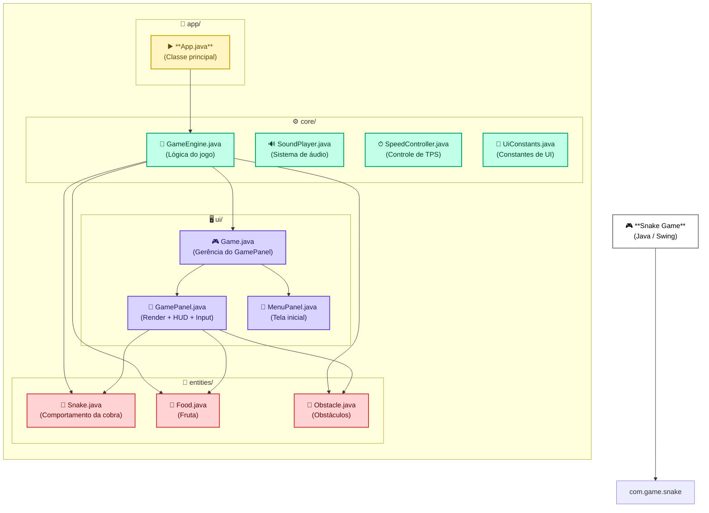

# 🐍 Snake Game

Um projeto inspirado no clássico Snake Game, desenvolvido em Java 17, utilizando Swing para interface gráfica, Maven para build, com sistema de som, obstáculos gerados dinamicamente, aumento progressivo de velocidade, menu inicial com seleção de cores e reinício de jogo.

---

## 🛠 Tecnologias Utilizadas

- **Java 17** — Linguagem principal do projeto
- **Swing** (Java AWT/Swing nativo) — Interface gráfica e renderização
- **Maven** — Gerenciamento de build e dependências
- **Lombok** — Geração automática de getters e melhorias de código
- **Javax Sound** — Reprodução dos arquivos de áudio .wav

---

## ▶ Como Executar

- Via Maven: `mvn exec:java`

---

## ✨ Principais Recursos

- **Seleção de cor** da cobra permitindo que o jogador escolha a cor antes de iniciar através do JColorChooser.
- **Obstáculos dinâmicos** que aparecem automaticamente a cada 5 frutas comidas, aumentando a dificuldade.
- **Aumento progressivo de velocidade** baseado no sistema de TPS (Ticks Per Second), deixando o jogo mais rápido conforme o jogador progride.
- **Sistema de som** utilizando arquivos eat.wav e gameover.wav, com a opção de ativar ou desativar pelo botão de mute.
- **Função de pausa** acessível tanto pela tecla SPACE quanto pelo botão na interface.
- **Reinício rápido do jogo** que pode ser feito pelo botão “Restart” ou pressionando a tecla “R”.
- **Olhos animados da cobra** que se movem conforme a direção escolhida, adicionando personalidade ao gameplay.

---

### 🎨 Tela Inicial – Menu

_Exibe o título estilizado_
_Botão START no centro_
_Ajuda com controles no canto inferior_
_Seleção de cor da cobra via JColorChooser_
_O jogo inicia com a cor selecionada_

### 💀 Tela de Game Over

_Mensagem estilizada em vermelho e verde_
_Exibe pontuação final_
_Botão de restart permanece visível_

### 🧠 GameEngine – Lógica central

#### O GameEngine controla:

_Movimento da cobra_
_Crescimento_
_Colisão com bordas_
_Colisão com o próprio corpo_
_Geração e posicionamento da fruta_
_Criação de obstáculos_
_Velocidade adaptada dinamicamente (TPS)_

#### 🟢 A cada fruta:

`speed.onFruitEaten();`

#### 🧱 A cada 5 frutas:

`addRandomObstacle();`

#### 🌈 Cobra (Snake.java)

_Cor personalizada_
_Corpo cresce suavemente_
_Olhos apontam na direção do movimento_
_Movimento não permite reversão imediata_

#### 🧱 Obstáculos – Tijolos com textura

_Textura criada com TexturePaint_
_Tons variados de tijolos_
_Sombreamento e destaque_
_Cache para performance_

#### 🔊 Sistema de Som

##### Arquivos localizados em:

- src/main/resources/sounds/

#### Reprodução via:

`SoundPlayer.play("eat.wav");`
`SoundPlayer.play("gameover.wav");`

_Botão de mute: 🔊 / 🔇_

## 📐 Arquitetura do Projeto

